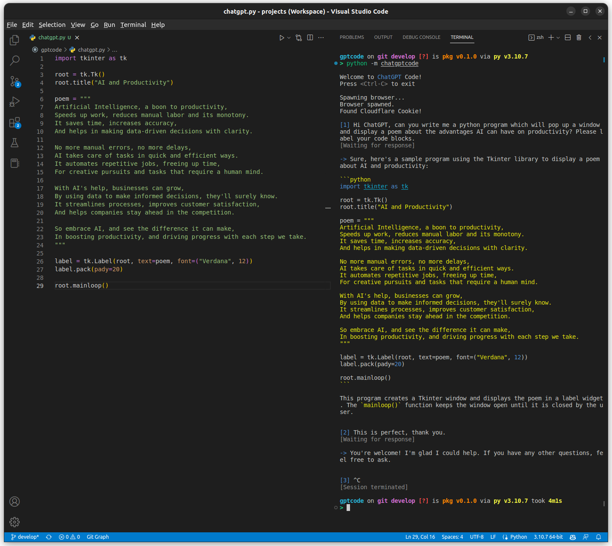

# Chat GPT Code
This extension is for terminal based AI assisted programming. It takes advantage of the [ChatGPT](https://github.com/acheong08/ChatGPT) python package and has additional formatting to make it easier to use for developers.



## Installation
Chat GPT Code can be installed with pip:
```bash
> pip install chatgptcode
```

## Setup
Create a file called `config.json` in folder `.gptcode` in your home directory. The file should be formatted as follows, where `session_token` referers to the `__Secure-next-auth.session-token` to the browser cookie found on the chat GPT website ([see terry3041's guide for additional info](https://github.com/terry3041/pyChatGPT)):

```json
{
  "session_token": "eyJhbGciOiJkaXIiL...",
}
```

## Usage
To run the app with poetry use the following command. In order for this to work you'll need to have chrome or chromium installed. A browser instance will pop up, connect to chat GPT, and then will automatically be hidden from view.
```bash
> python -m chatgptcode
```

You can then ask chat GPT questions and get a response in your terminal! With nicely formatted code and easy to read output.

Thanks so much to user [acheong08](https://github.com/acheong08) for the amazing [ChatGPT Python package](https://github.com/acheong08/ChatGPT) which this is based on!